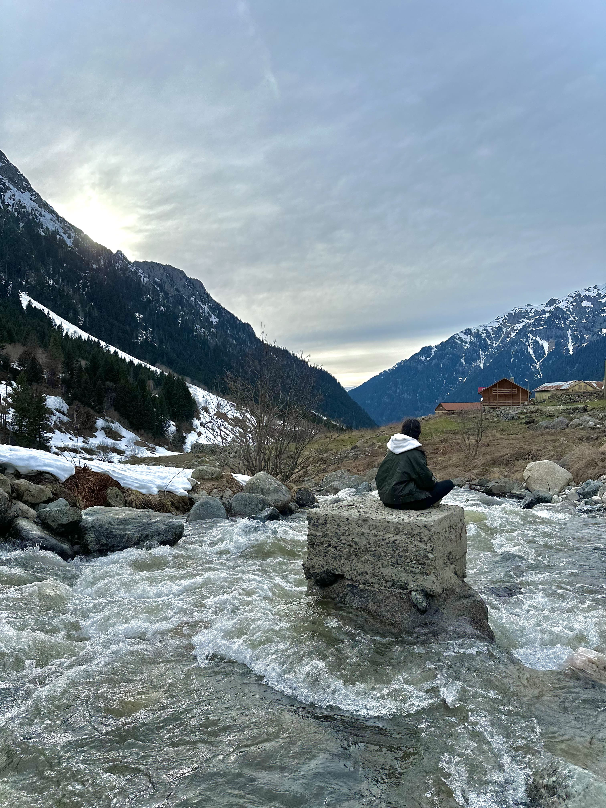

# 

|  |  |
|------|-------|
| I completed my Bachelor’s in Communication and Design, where I worked on my creative skills and developed a strong visual sensibility. Over the course of my career, I’ve explored the intersection of multiple creative fields, blending photography, videography, and motion design to craft compelling stories. I am now expanding my perspective and approach, eager to push the boundaries of design and explore new ways of thinking.| {width=" 2000 "} |

