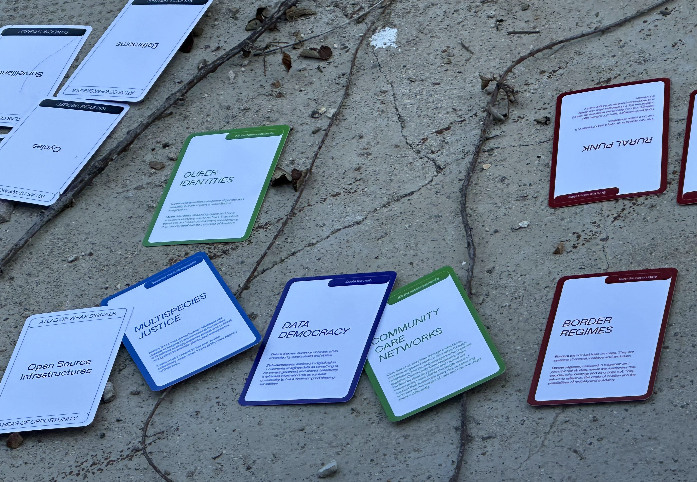

# Group Weak Signal 

Poison Pilling

Description: Poison pilling (or data poisoning) is the deliberate insertion of malicious, misleading, or corrupted data into datasets used to train machine learning or AI models. The goal is to “poison” the model’s learning process so it behaves incorrectly, produces biased or nonsensical outputs, or even leaks sensitive data.

*the definition was copied from ChatGPT when asked: “Do you know what poison pilling is as it relates to putting in data that messed up ai data training?”  

We later asked ChatGPT how it felt about this practice. Ask us if you want to read its response. 

https://chatgpt.com/share/6937e4f3-3b4c-8009-a287-3997a9f7259c 

Open-source Sufficiency

**Doubth The Truth:**
  Creative Dissent

**Areas of Oppotunity:**
  Restorative Practives

**Random Trigger:**
  DIY Tools

discussion topics:

 - anarchist cookbook
 - repair workshops
 - Sudan protesto creative ways to resist 
 - parasitic architecture
 - music
 - it is never individual

**Open-source Sufficiency**
Self-sufficiency is often imagined as an individual act, but it has never been true. Every tool, technique, and repair depends on shared knowledge passed between people and across generations.

Open-source sufficiency treats this knowledge as a commons, where tools, repairs, and practices circulate freely so individuals can build resilience together.

Group Members:
Beste, Ayal, Agnese, Max, Heba, Aiman

