## CO I “Seeding Memories” Reflection

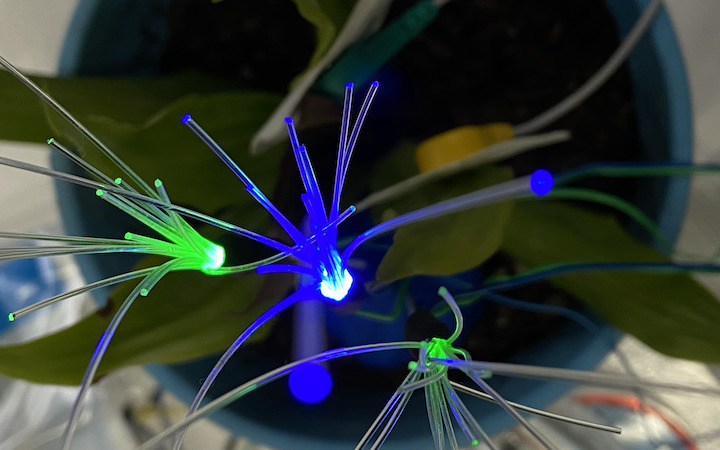

We stayed with the same group and without really limiting ourselves tried to develop the previous project according to the brief. 2 intelligences needed to communicate. What is intelligence? What is communication? The common meanings were determined after a short discussion. On our first project “Echoes of earth” we kind of did this. We tried to translate the tree data into a real time sound and visual manipulation. But it wasn’t an active communication in terms of the 2nd intelligence.

So for this project from the start we knew our common interests, and when the 2 intelligence was on the table it was easy for us to decide on ecological intelligence. We wanted to focus on the environment, either matter, stones or trees again. Information, archive, memory and translation were still on the table, we wanted to focus on them and as a result the tree sounded more relatable, as the wise. We also thought about Avatar and that relationship and communication. 

We decided to communicate a memory and store it in a tree. But how? To make this double ways, we needed the tree to communicate as well, so the first step was to decide on a sensor. We went with EMG because trees vibrate in response to certain situations. But didn’t quite go as planned, it took us some time to figure out the cause of the reading because it was super sensitive and get the number we want. While Swarna was trying to figure that out with the help of Mikel, I tried to figure out the communication bit. Now we decided that since these memories will be intimate and personal we wanted to encrypt it. So the sensor data should be merged with the voice and transform it into something not understandable. Claude, wrote me some phyton codes, and I tried to play with it in order to adjust the audio into something we liked. But it wasn't giving us much room to play, the audio was really disturbing, scattering. Before making phyton and Arduino communicate I manually entered data to terminal, but later we tried and make real-time data work with the code as a backup option. Because now we decided to move to Touchdesigner to be able to manipulate the audio as we wanted. 

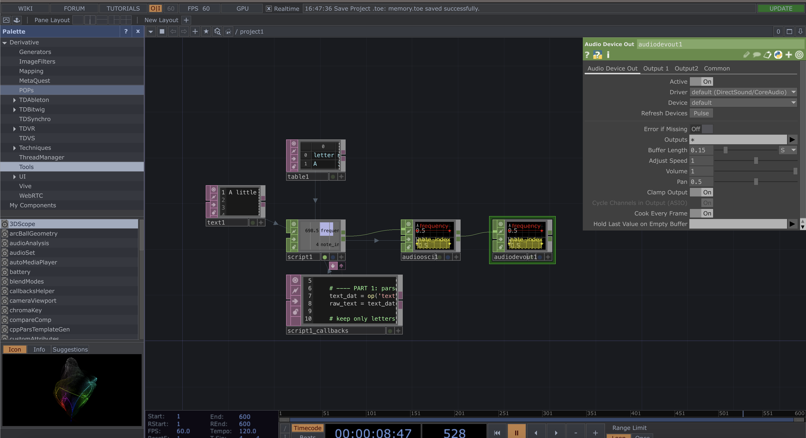

Building the touchdesigner skeleton was not that hard because we already did it in the previous project. But the since this was not only the sensor data becoming an audio, it needed to manipulate the voice (memory) so much that it is not audible, I needed to try out different effects. So the main serial data, would connect to the audio device in with an audio filter. This was changing the voice quite a bit but it was still understandable, so I added a beat chop that was connected to the incoming data and it gave an heart beat like effect, also some delay and a background frequency made the overall audio more smooth and natural. So now as you spoke the voice would be split and beaten by the data. 

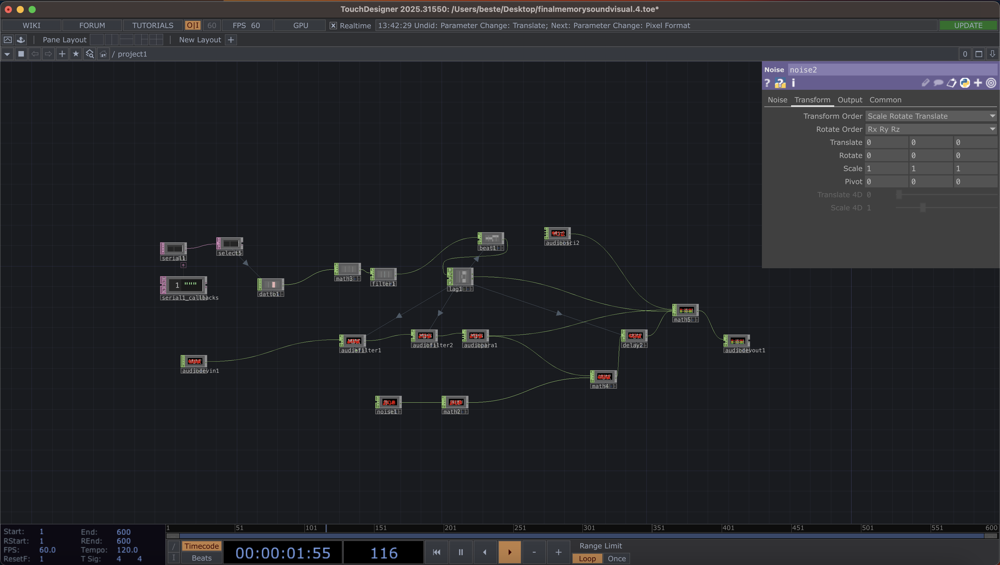

For this session we were not able to figure out how to record or decrypt the audio. But we are planning on continuing the project, we looked into optical encoding, and some other examples of storing information in nature. 

P.S. I also crushed the programme right before the presentations, because I was trying to add audio reactive visuals and I guess it was too much for my machine because the whole screen glitched and laptop got super hot. Real-time data from Arduino, microphone, and charge with 3d visuals might be too much for laptops. 

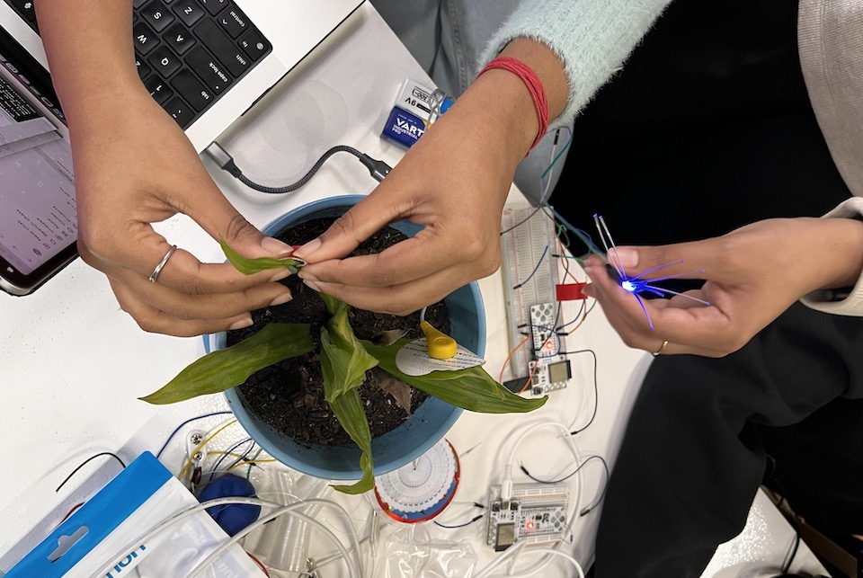

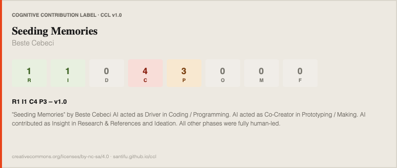

## CO II “Echoes of Earth” Reflection

[project link: https://www.hackster.io/544134/echoes-of-earth-099b88](https://www.hackster.io/544134/echoes-of-earth-099b88)

I am really proud of the project we developed. Even though it was hard to merge our personal projects in some ways at the beginning, we all had the same vision of what we wanted this artifact to be. But I guess it was too broad or we couldn’t word it well in the first presentation. I always find it hard to describe what I have in mind or what I develop during the process and explain it with words. I do believe that the outcome speaks for itself. I know for this class it was important to share our struggles and problem-solving for others and for ourselves, to help us in future projects.
Echoes of Earth is an artifact that translates what is underneath the soil by reading soil moisture data and influencing a real-time root visual and sound. It also has LEDs to resemble fireflies, which ties the whole concept together by mimicking them in showcasing the health and condition of the soil.

When we were ideating, one of the references resembled fireflies to me, and we all immediately started sharing our own stories of seeing them and how magical those moments felt. We didn’t continue with it while developing the concept and the tech, but it somehow came back and completed the narrative of our project.

This is definitely a work in progress. It has the potential to become more. Currently, it is a human-centric device that only reflects one single data. More sensors can be added, but also an action can be generated for it to expand the connection with earth that it creates.

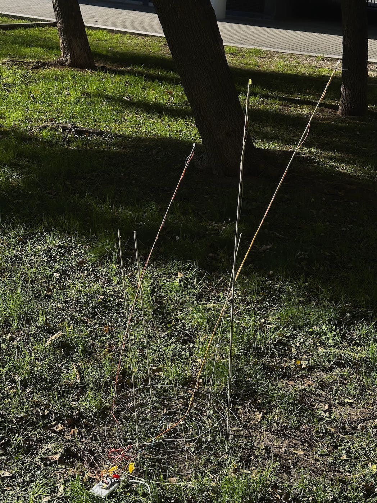

In my personal project, I will try to figure out ways to scan scars left on the environment . So learning about GPR and seeing what sensors we have felt like first steps toward that as well. Becoming aware of public datasets also gave me some ideas.
I also really enjoyed working on this project because we were fewer people in the group and were able to divide the workload based on our interests and strengths. I worked on the digital visual output of the project in TouchDesigner. I wouldn’t say it’s my strength because I haven’t worked with it before, except for generating audio for another project. The visualization part and incorporating data were all new to me. So I followed lots of tutorials, mixed and matched their workflows, and Armin helped me a lot along the way.

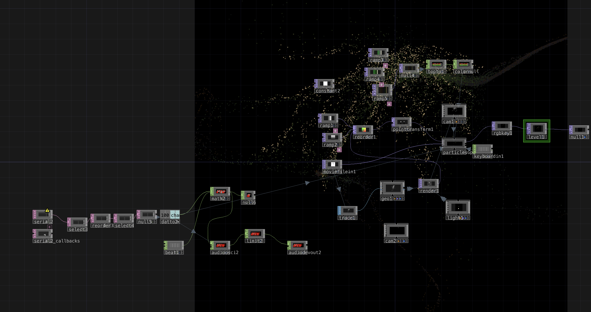

We ended up with a working skeleton, which didn’t work properly during the presentation, so it wasn’t as effective. When deciding what the visual should look like, I stuck with the idea that we wanted to show what we cannot see under the soil. I took reference from one of the root images in the datasets we found and tried to add movement and abstract it without losing too much detail. It still needs more tweaks and experimentation, but right now, as the sensor goes deeper into the soil, the particles come together from a scattered stage and form the root image. The data is also linked to base frequency levels, and the audio changes with different moisture levels, which supports the impact of the experience.

This project was possible thanks to the FabLab team. I appreciate their help, references and feedback!

Datasets mentioned: 
https://www.wur.nl/en/library/image-collections?utm_source=verkorte_url&utm_medium=redirect  
https://www.sentinel-hub.com/ 
https://www.esa.int/Applications/Observing_the_Earth/Copernicus/Sentinel-2 
https://harvardforest.fas.harvard.edu/data-archives/data-archive/ 
https://app1.icgc.cat/web/en/sismologia_sismograma_v2.php?dia=active 

## CO III “Sensescape” Reflection

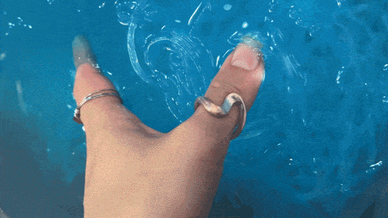

A multi-sensory experience. Our starting point was the experience itself, what we wanted the people interacting with it to feel. We agreed on creating a contrast of emotions, wanting people to start with one feeling and evolve into another through the interaction. One of the questions we kept coming back to was: "how can we make a sound touch you?"
Generating audio through touch was something we had already explored in our Design Dialogues project, where touching pieces of clay on top of a brass sheet acting as a capacitive sensor, created a sonic output that changed frequencies based on real-time data. In this project we wanted to build on that by adding as many sensors as possible and introducing different materials. After a lot of loops and discussions about how to create that emotional shift, Heba came up with the idea of Twister the game. We wanted the materials to feel like a mystery, so the production raised a lot of questions. What should the platform look like, what could cover it, where would the sensors go, and how.

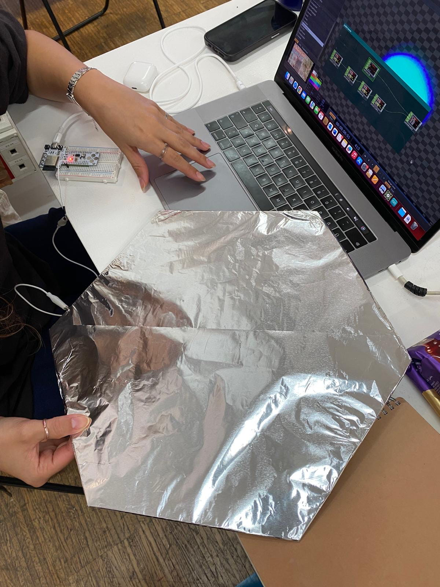

In terms of building the artifact and the software side, we ran into several challenges along the way.
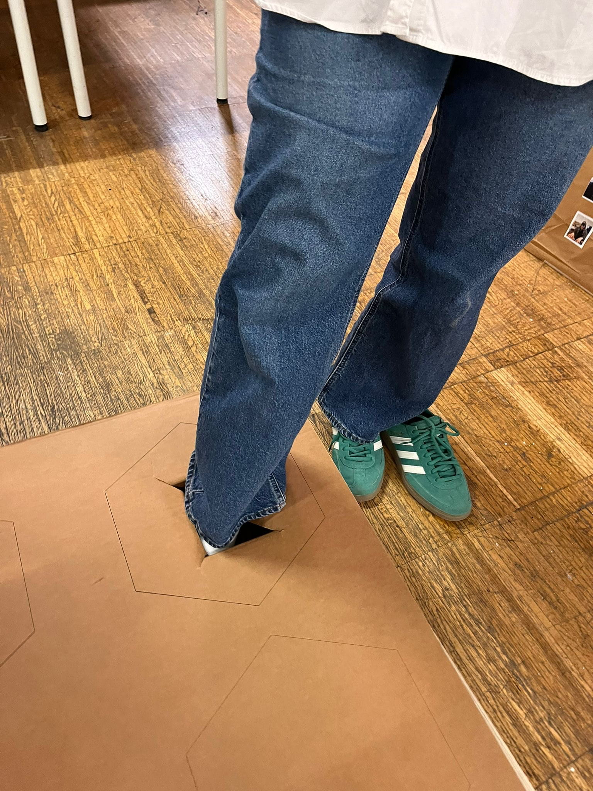

The first learning was that there is no need to map data in the code if you are using TouchDesigner for the output, because you can do it easily using Math CHOPs. You can see the readings directly and based on those values determine the range of each material's untouched state. The first code Claude gave me included mapping, and the values I was reading were in the millions, when readings are that high, the circuit needs a ground, which we didn't know at first. It was hard to figure out, but thanks to Mikel we understood why the sensor wasn't reading when touched alone, but would start reading when you touched the computer with one hand and the sensor with the other. When the values are lower, which should be the case from the start, the sensors work perfectly. So a grounding problem can directly affect the quality of the readings.

The second learning was around communication between boards. We initially tried to implement the ESP-NOW protocol with two boards so that the computer wouldn't need to be physically connected to the artifact. Aurel then introduced us to a simpler way: through UDP over WiFi , where data is sent directly to TouchDesigner using a single board. To set it up you just add the WiFi credentials and the computer's IP address into the code, and in TouchDesigner you use a "UDP DAT" instead of a "Serial DAT." One thing to remember: if you move to a different location or switch to a hotspot, you need to update the IP address.

The third learning came during the presentation, where the artifact wasn't working correctly. The data was transferring fine and mapping correctly, but the sound output was only working for two sensors, touching more than one at the same time would either go silent or one sound would overpower the others. After digging into it I found a couple of reasons for this. First, in the Math CHOP the properties "Combine Channels" and "Combine CHOPs" behave differently. Combine Channels works within a single input and merges the channels inside it, while Combine CHOPs takes multiple separate inputs and combines them together, which was what I actually needed. Second, and more importantly, was a volume issue. The Math CHOP multiplies every input introduced to it, so when more than one input is active they can together exceed the 0–1 range, causing the output to go silent. The solution was to add an individual Math CHOP before each sensor's signal reaches the final combining CHOP, and in each of those set the Multiply parameter from 1 to 0.25. That way, even when all four sensors are touched at once, the final Math CHOP receives a combined value of exactly 1 and outputs clean audio.

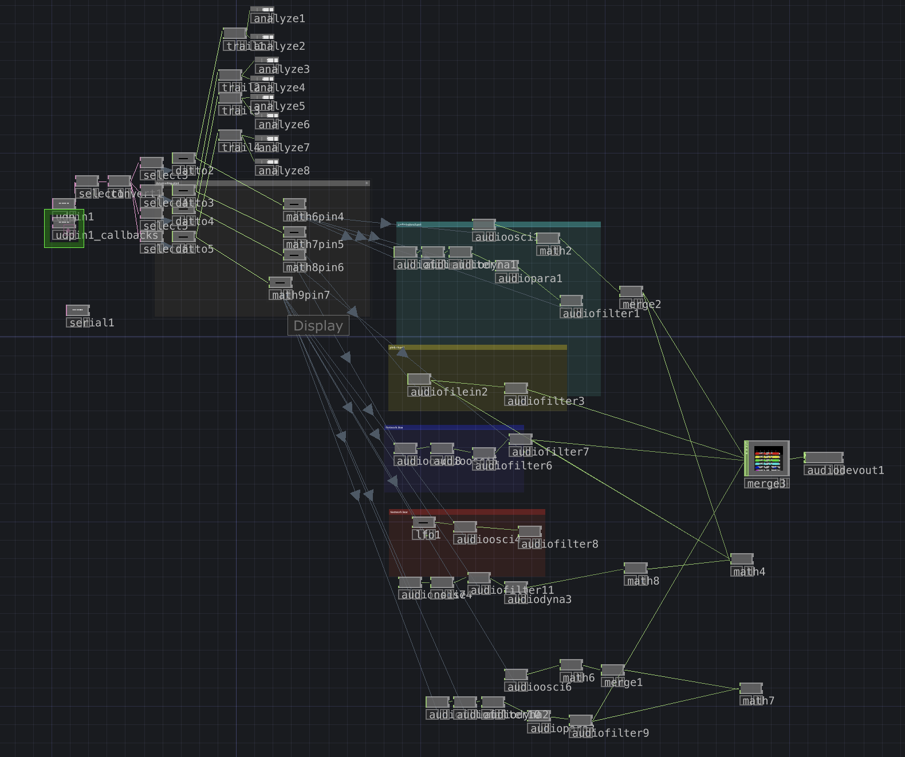

Even though in the end of cognitive orgies presentation it didn’t work we figured out everything until Sunday to use our artifact in out myth and it was super engaging with different materials that the participants found.

<video controls playsinline>
  <source src="../../images/fixed-2.mp4" type="video/mp4">
  Your browser does not support the video tag.
</video>