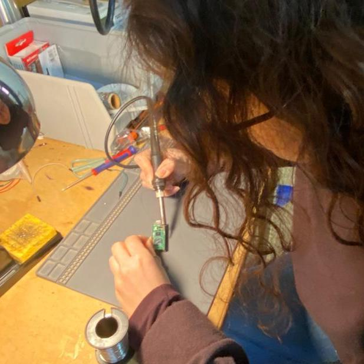

## Extended Intelligences II: MOOD BOOSTER SONG AGENT

When we started putting out ideas, “the effect of sunshine on our mood” was the one we all agreed on and deeply related to in our daily lives. Knowing the conditions outside first thing in the morning to help define our mood felt like a positive addition to a daily routine. So, it was time to solidify the idea and figure out the steps to make it happen.

From sunshine, we generalized the concept to weather, so it became like the weather itself was requesting a song, almost like a weather radio. The next question was what technology we had available and what data we wanted to use. We wanted to somehow incorporate both the local environmental status and the general city weather condition. We looked at different sensors at FabLab and decided to use a light sensor, since our initial idea was based on sunlight’s effect on mood. To distribute the workload, we divided the group into pairs, and I was in the group handling the LDR sensor.
The sensor gives analog light intensity values, where lower values indicate darkness and higher values indicate a brighter environment. From this point on, I’m not completely sure I understand how the data transfer works from the Raspberry Pi to the AI agent through the network. However, it was very inspiring to become aware of the possibility of continuous data transfer through an input sensor for future projects. And we already used it on one.

 

After connecting all the parts in the AI agent builder, we were able to get an output: the AI suggested a mood stabilizing song based on the sensor value and the online weather data it collected. The sensor value interpretation by the agent was questionable and needed more testing, because it still showed “bright” even after we blocked the light coming to the sensor. Still, we ended up with a working prototype that could be further developed.

To develop the project further, we discussed doing deeper research on weather factors that affect our mood in order to better understand the topic and guide the agent more accurately. We also talked about improving the output by thinking about how and where the music recommendation could be played. A visual element, such as light, could be added, and the system could be integrated into smart homes or public transportation.
Overall, my personal learning from this course was realizing how much I didn’t know about using AI and its potential. I believe I would still prefer not to use it when it is not needed, but becoming aware of what can be done with it and how to use it properly was eye-opening. The importance of structure while prompting, shaping the text based on the desired outcome, showed me that it can also be a useful practice for communicating ideas more clearly.

Circuit & Code source : https://docs.sunfounder.com/projects/pico-2w-kit/en/latest/pyproject/py_photoresistor.html
