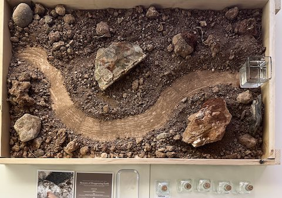
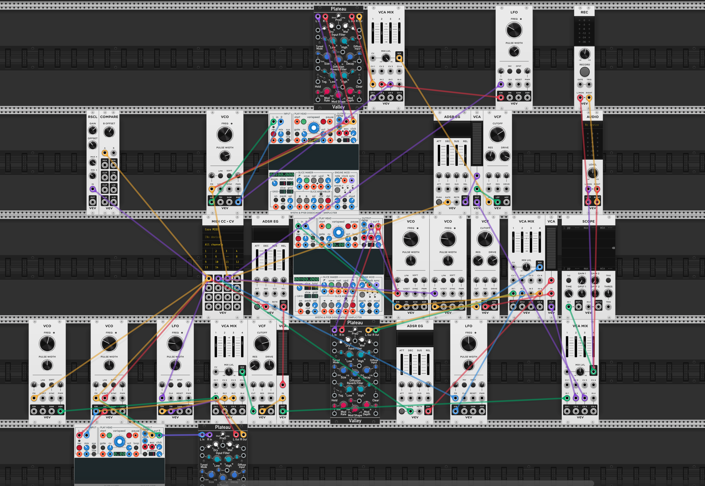
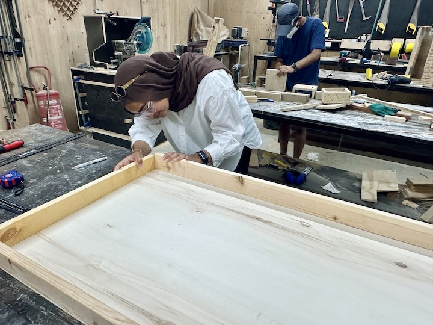
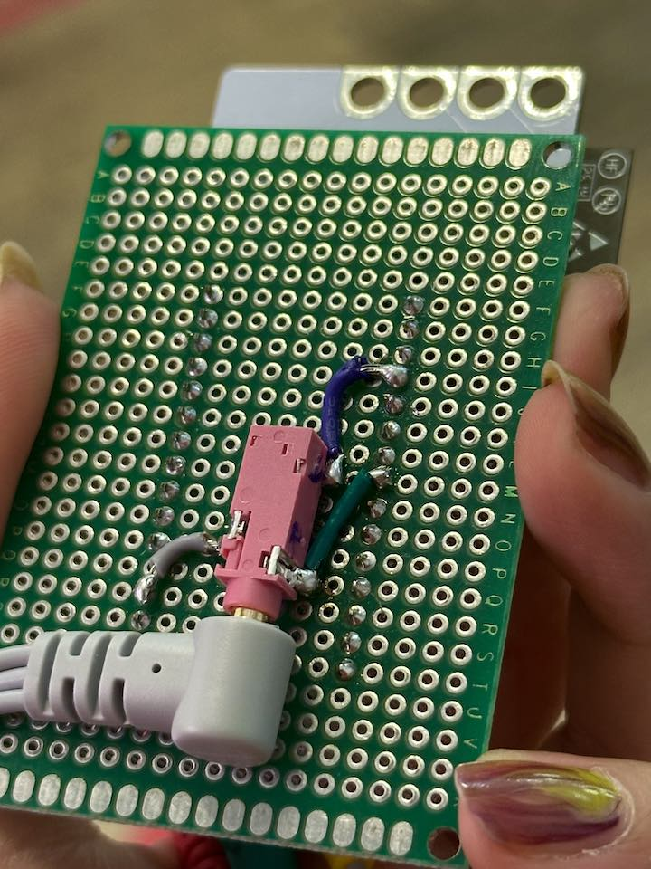
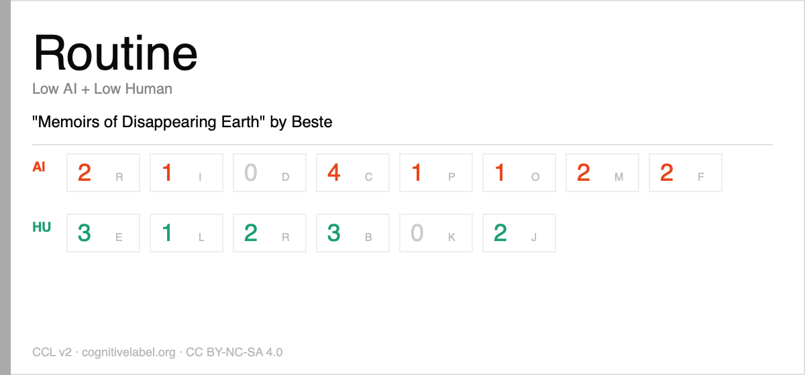

## Process

How can we make this interaction portable? This was our starting point in this fabrication cycle, and it honestly made us turn in circles because it brought up more questions and changes for our working prototype. For me, trying to balance the idea of a "passive exhibition" and a live "activation" confused things further. We wanted people to be able to interact with our artifact even when we weren't there, but our system was heavily dependent on a computer and specific software.
Our first idea was to see if we could run our previous TouchDesigner system through a Raspberry Pi, but that option didn't look promising. This made us question whether we should change the software entirely. Initially, we always had the idea to implement visuals as well, but at this stage, sound was the main focus we wanted to ace. Visuals didn't seem to fit anymore when we were trying to encourage people to be outside, observe, and physically touch the materials. This pivot brought us to VCV Rack, a modular synthesis program. None of us had prior experience with audio synthesis, so putting aside the portability aspect for a moment, I started learning how to generate our audio.
We had already gone back to our starting point a couple of times by then, so things had to move quickly. I tried to achieve the sound and logic I envisioned using Claude and some online tutorials. However, thanks to a session with Tim, I finally started understanding what I was actually doing. That was a major moment for me where I realized that even if you prompt an AI to explain things in detail or ask questions about what it is instructing you to do, it will never be as effective as a human being sitting next to you and teaching you.

Another setback came during the design reviews. New people brought new ideas, which meant constant changes to the project. The feedback was very helpful, and reviewers commented on valid areas for improvement, but receiving this at a stage when we had very limited time was a bit demotivating. We shifted the system from one sensor to four, back to one, and then finally to three, changing our software and our narrative a few times. But again, thanks to their critiques, we were able to clearly see the weak points and the strong parts we needed to focus on.
We still needed to design the physical part of the artifact—deciding where the materials would sit, how people would touch them, and what the interaction protocol would be. We ideated around this for a while. First, we wanted a circular sensor area embedded with LEDs to create a ritualistic aesthetic. Then, we decided to include water as one of the elements, which made things even more complicated due to waterproofing requirements. We looked into creating a sculptural bowl from biomaterial recipes, but we simply did not have enough time.
At this point, our approach to using a single sensor changed, meaning we required more space. Furthermore, we realized the raw surface itself shouldn't act as the sensor. Citlali pointed out that when the surface was the sensor, it defeated the purpose of hearing the material because it caused people to mostly hear their own body's capacitance. To solve this, we decided the sensors should be attached to the material, and each material should have its own baseline sound based on field recordings manipulated with data. We chose to use ECG cables as the conductive link: users would touch the sensor link first and then touch the material itself to hear the acoustic change their interaction brings. With Lara’s suggestion to recreate the landscape of the river, the physical design finally started coming together, and Heba thankfully took over the fabrication process.

We encountered several technical issues with the cables. The system would get stuck because the data occasionally jumped to extremely high values. For some reason, pin 8 on the microcontroller board did not function, which messed up the other two pins. Individually, I could get clean readings from pin 4 and pin 14, but pin 8 gave nothing, and when all three were connected together, the readings would lock up. To resolve this, I had to remap the connection to pin 10.

Additionally, because we were working with capacitive sensors, the physical volume of the material and its current structural state played a major role in calibration. As a result, our studio trials were never completely accurate for the final setup; we still needed to collect the actual materials directly from the site and recalibrate the final data mapping.
Working in a team was incredibly helpful throughout this process. It allowed us to combine our individual strengths and provided crucial mental support. When one of us felt down or exhausted, the others would remind them of our goal and the potential success of the project.

Ultimately, the passive exhibition format remained a challenge. Even though people could understand how to interact with our artifact on their own, we didn't want to leave our personal laptops unattended at the site. Therefore, we structured the final interaction to be guided through our website interface. And for the festival, we introduced a collective activation where audiences generated their unique compositions through interacting with this disappearing materiality.

<iframe src="https://player.vimeo.com/video/1203038582?badge=0&amp;autopause=0&amp;player_id=0&amp;app_id=58479" frameborder="0" allow="autoplay; fullscreen; picture-in-picture; clipboard-write; encrypted-media; web-share" referrerpolicy="strict-origin-when-cross-origin" style="position:absolute;top:0;left:0;width:100%;height:100%;" title="Memoirs of Disappearing Earth - Activation"></iframe>

Hacksterio: https://www.hackster.io/bestecebeci/memoirs-of-disappearing-earth-ac3249
Project Website: https://beste-cebeci.github.io/mode/work.html

