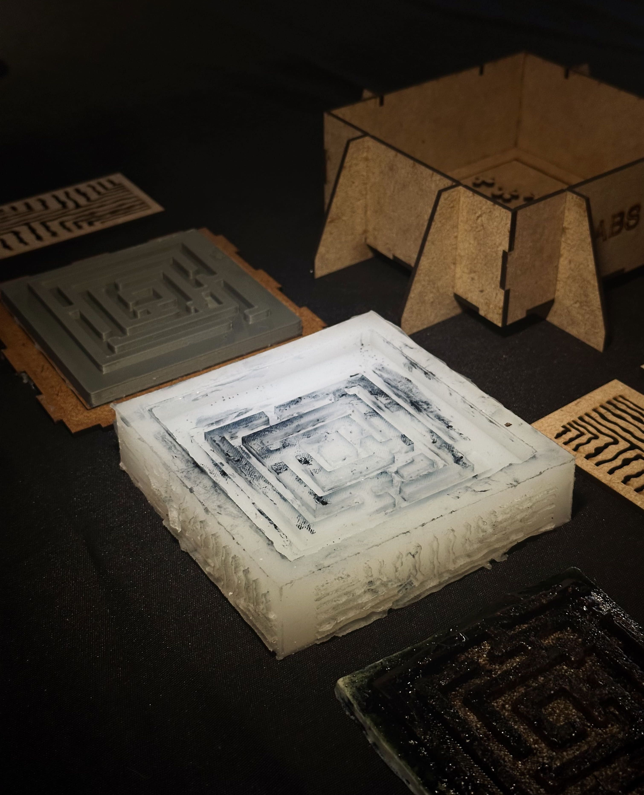

# Fundamentals for Future Makers Course Reflection

The Fundamentals for Future Makers course was a highly engaging introduction to digital fabrication, material experimentation, and hands-on making. Throughout the term, we worked with a wide range of tools and processes, including laser cutting, CNC milling, 3D printing, silicone molding, and bio-material casting. Rather than focusing only on outcomes, the course emphasized learning through experimentation, testing, and failure, which became one of the most valuable takeaways for me.

Electronics and Barduino

This was one of the most satisfying parts of the course for me. Learning how to identify and connect inputs and outputs, and understanding how they interact through code, was eye-opening.

We experimented with components such as LEDs, buttons, touch sensors, and a micro servo motor. Figuring out how to control these elements through the board showed how digital logic can translate into physical movement, light, and interaction. 

Laser Cutting and Design for Fabrication

As a group project, we laser cut an MDF box that later served as the container for a mold. One key lesson during laser cutting was the importance of accurate material measurement before fabrication. We initially assumed the MDF was sufficient, but it turned out to be approximately half a centimeter shorter than expected. If our instructor had not measured the material beforehand, the cut would have failed. This experience reinforced a fundamental rule of digital fabrication: never assume, always measure!

Additionally, during the design phase, we learned about the importance of line spacing and kerf considerations. Our initial design had lines placed too close together, which caused cutting issues. We had to revise the design by increasing the distance between paths to ensure clean cuts. 

3D Printing and Mold Making

For the mold-making process, we designed and 3D printed a positive model that fit inside the laser-cut box. The printed form was a maze-like structure, and an important design consideration was ensuring that all shapes were properly merged into a single manifold object to avoid printing errors. Compared to other processes, 3D printing was relatively smooth.

Silicone Molding and CNC Milling

Silicone molding was one of my favorite parts of the course, as it clearly demonstrated how digital fabrication can interface with soft materials and casting processes. Creating the silicone mold from our 3D-printed positive allowed us to translate rigid digital geometry into a flexible, reusable mold.

CNC milling, on the other hand, was more challenging. The combination of material choice, design geometry, and tool diameter led to some cracking, particularly around rounded corners. Maybe changing into a smaller milling bit could have produced better results.

Bio-material Casting and Material Experimentation

For the final casting step, we experimented with bio-material recipes, mixing two different formulations to observe how their properties interacted. The results were interesting, reinforcing the experimental nature of working with organic materials. One issue we encountered was with pigmentation: both indigo and food colorings failed to dry properly within the bio-material.

Key Takeaways

Overall, the course helped me understand making as a process of design, testing, failure, and refinement. Rather than seeing mistakes as setbacks, I learned to treat them as critical sources of information. The hands-on exposure to multiple fabrication techniques, combined with material experimentation, has given me a stronger foundation for future projects and appreciate process-driven design.

