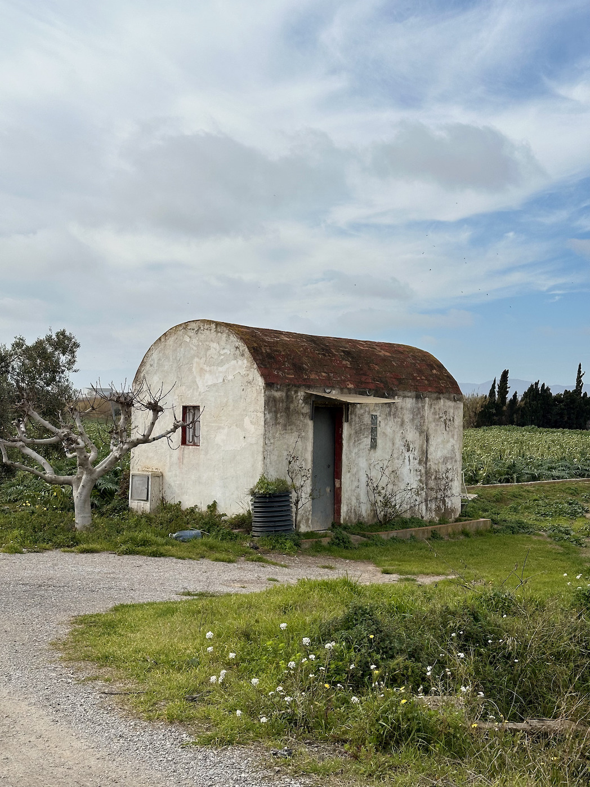
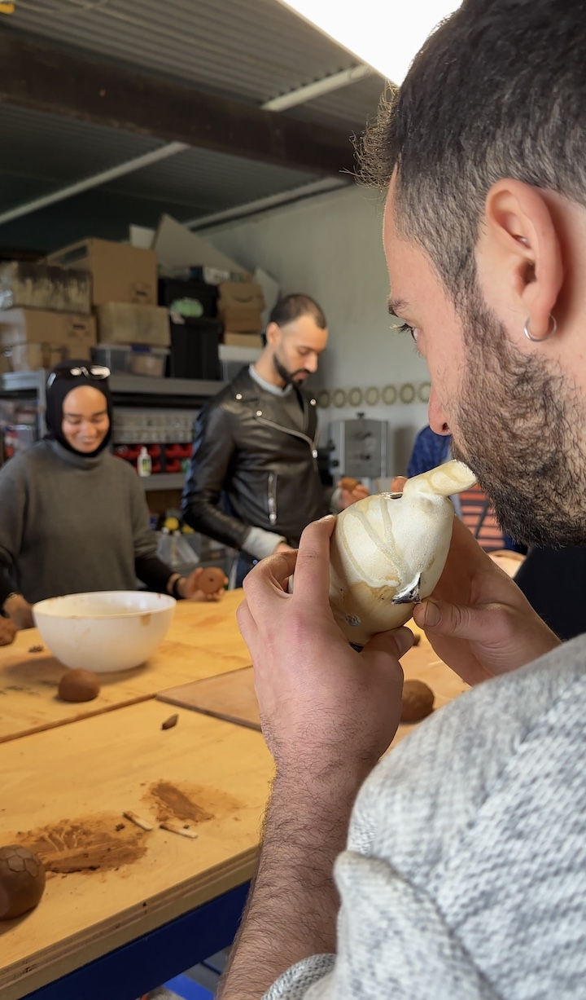
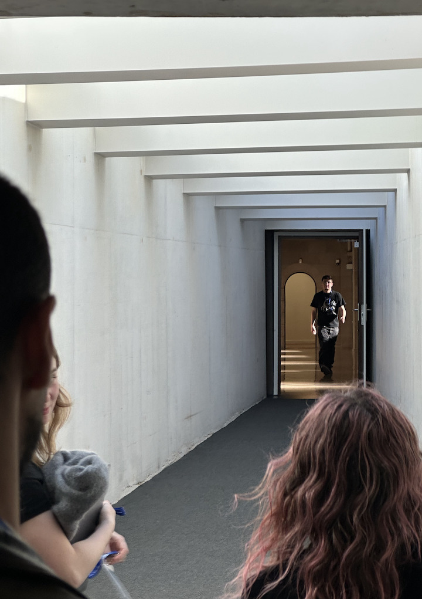

Situating on a bike at Cal Negre was my favourite class so far, and not just because I got to pet two dogs and touch clay at exactly the moment I needed grounding. It's because I figured I learn best this way. At a location, listening to people, practising their work alongside them. There's something that just doesn't translate to a classroom.

What stayed with me was hearing firsthand how a rerouted riverbed continues to affect the farmers and community around it. The scar isn't metaphorical there. It's visible, physical, ongoing. And yet while those consequences are still being felt, new debates are already being held about expanding the airport and creating the same kind of wound on the other side. We keep making permanent marks for infrastructures that feel urgent now and extractive later. If you touch something hot and get burned, you learn not to touch it again. So why don't we extend that logic to the land?
This sits right at the core of my research. We experience the consequences of the scars we leave on the earth, but somehow that feedback loop doesn't close the way it does with our own bodies. I think part of it is distance. The scar on the riverbed isn't felt as personal. My work is trying to close that distance, to make a scar on a landscape feel as legible and as felt as one on skin.

Maria and Tom's festival installation moved me more than almost anything I've encountered this year, and we only saw it through a video. What got me was how backed up it was, in the story of the place, in material, in the body of the work itself. They found solutions on the spot, built around what the site gave them. The multisensory quality of it, the way it created an experience not a message, that's exactly what I want my own research to do.

Throughout Ozzline's talk I kept thinking about the male gaze. Whether what she does still objectifies the female body even when she is the one drawing, the one in control of the image. It's an artwork without question, but my issue is with the audience: how male-centric it is, and how much of that audience is genuinely engaging aesthetically or sentimentally versus just looking.

But the question that has stayed with me longer is the one she raised about privacy. Is our humanness reserved to the private? She showed bedrooms, desires and it made me ask where the boundary should be, and who gets to decide. In my own research I keep hitting this wall: how much do I share about my own scars? Why do I want to keep them private, is it protection, or is it shame, or both? And the people who've talked to me about their scars, answered my questions, shared childhood memories, physical histories, sometimes more. How much of that intimacy should I carry into the work, and how much should I shield?
Ozzline's practice made me look at healing differently. I come at it from trauma and marking, but pleasure and dominance are also a way to heal, a way to reclaim a body that has been marked. That reframe is something I want to sit with longer.
My community of impact is still forming. People who exist at the overlap, those who carry physical scars and those who feel the consequences of landscape ones, and anyone sitting in that strange place where both feel personal. I'm still finding out what it means to design with them rather than just for them. But I know the work needs to be the kind that creates encounter rather than explanation. A language that makes you feel the scar before you understand it.

