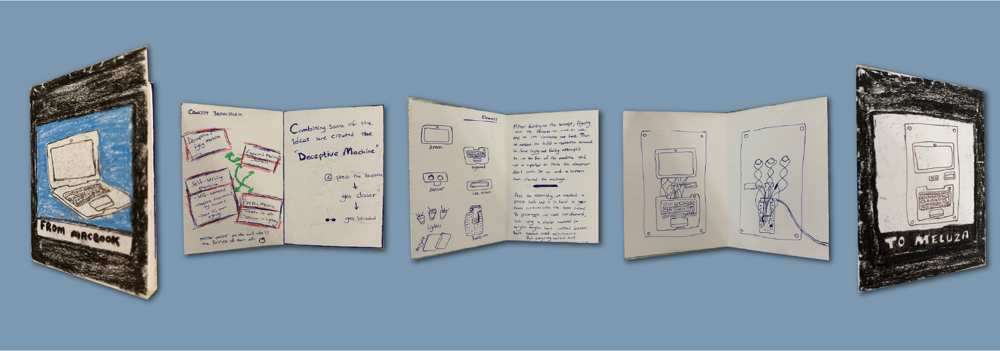

Unpacking a 2009 MacBook Reflection

For this project, our group explored several possible devices to disassemble speakers, a printer, and ultimately, an old 2009 MacBook. From the outside, the MacBook presents itself as a clean, minimal, almost effortless machine. But the moment we removed the case, we were met with an entirely different reality; countless screws, layers of dust, and a maze of unidentified cables.
Documenting each step and component turned out to be far more time consuming than I expected. Many of the internal parts were difficult to identify, especially elements on the motherboard that lacked labels or specifications. Still, it was fascinating to recognize components from brands like Intel and Samsung inside what is marketed as a purely “Apple” product.
Unraveling this previously sealed-off object was genuinely exciting. Seeing the sheer number of components required for the machine to function and imagining what each part might become in a new context was inspiring, even though very few of the parts still worked. My main focus ended up being documentation: photographing pieces, organizing them, and writing the inventory. I also attempted to get the screen’s backlight working with Mikel’s help, but I gave up rather quickly. It wasn’t an LED screen, and the cables in it’s inverter board were not specified, so it needed more trial and error. 
To be honest, forming the groups was my least favorite part of the class. I understand the logic of dividing by strengths and redistributing people, but the groups weren’t balanced. We ended up in a large team, which made collaboration more challenging. Even so, the project sparked a lot of curiosity in me. I’m already thinking about finding more broken devices to unpack, my next target is a camcorder.
One major takeaway from this experience is something I’ll never forget: never throw away a broken computer without dealing with the hard drive. By accessing the hard drive of the MacBook, we were able to find out who the laptop belonged to and even browse some of their personal files. It was a huge reminder of how easily someone’s data can be exposed. I definitely wouldn’t want that to happen to me, and I’ll keep this lesson in mind moving forward.

 

Machine Paradox

 

Links

<a href="https://hackmd.io/@M_mbpDG9RfCkv3Hh2okOvw/BkdWfLolbe" target="_blank">Forensic Report</a>

<a href="https://docs.google.com/spreadsheets/d/1nhxFCAaLnu5iB0xfygtxfu7oa6Qrs6oYqWyNHF1m7AE/edit?gid=0#gid=0" target="_blank">Inventory</a>

<a href="https://docs.google.com/presentation/d/1yEwyA1XbDtHeK4ixy4tmtcUPgdfOU9xSFolHBjHSZMg/edit?slide=id.p#slide=id.p
" target="_blank">Presentation</a>

<a href="https://drive.google.com/file/d/1aW3gkNi_JAU18vEawTKH0_QISoeVeGH6/view" target="_blank">Video</a>

